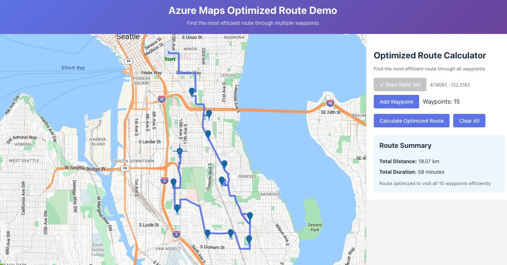

# Azure Maps Optimized Route Demo

A React + TypeScript application for calculating optimized routes through multiple waypoints using Azure Maps. Find the most efficient path to visit all your destinations with automatic route optimization.



## Features

- 🗺️ Interactive Azure Maps integration with crosshair positioning
- 📍 Set start point and add multiple waypoints
- ⚡ Automatic route optimization for efficient travel
- 🛣️ Visual route display with bold path lines
- 📊 Total distance and duration calculations
- 🎨 Modern, responsive UI
- ⚛️ Built with React 19, TypeScript, and Vite

## Prerequisites

- Node.js (latest LTS recommended; see `.nvmrc`)
- npm 10+
- An Azure Maps account with a subscription key ([Get one here](https://portal.azure.com))

## Setup

1. **Clone the repository**
   ```bash
   git clone <your-repo-url>
   cd azure-maps-demo
   ```

2. **Use a supported Node.js version (recommended)**
   ```bash
   nvm install
   nvm use
   ```

3. **Install dependencies**
   ```bash
   npm install
   ```

4. **Configure Azure Maps**
   - Copy the environment template:
     ```bash
     cp .env.example .env
     ```
   - Add your Azure Maps subscription key to `.env`:
     ```
     VITE_AZURE_MAPS_SUBSCRIPTION_KEY=your_key_here
     ```

5. **Start development server**
   ```bash
   npm run dev
   ```
   The app will open at http://localhost:5173

## Usage

1. **Set Start Point**: Click "Set Start Point" to mark your starting location (green pin)
2. **Add Waypoints**: Position the map crosshair and click "Add Waypoint" to add stops (blue markers)
3. **Calculate Route**: Click "Calculate Optimized Route" to compute the most efficient path
4. **View Results**: See the route drawn on the map with total distance and duration

The app automatically optimizes the order of waypoints to minimize total travel time!

## Project Structure

```
src/
├── components/
│   ├── AzureMap.tsx       # Map component with crosshair overlay
│   └── RouteMatrix.tsx    # Optimized route calculator UI
├── types/
│   └── routeMatrix.ts     # TypeScript interfaces
├── App.tsx                # Main application component
├── App.css                # Application styles
└── main.tsx               # Entry point
```

## Azure Maps Route Optimization

This demo uses the [Azure Maps Route Directions API](https://docs.microsoft.com/azure/azure-maps/how-to-use-best-practices-for-routing) with the `computeBestOrder=true` parameter to automatically optimize waypoint order for:

- Delivery route planning
- Multi-stop trip optimization  
- Field service scheduling
- Last-mile logistics
- Travel itinerary planning

## Tech Stack

- **React 19** - UI framework
- **TypeScript** - Type safety
- **Vite** - Fast build tool
- **Azure Maps Web SDK** - Map rendering and controls
- **Azure Maps REST API** - Route optimization

## Available Scripts

- `npm run dev` - Start development server
- `npm run build` - Build for production
- `npm run preview` - Preview production build
- `npm run lint` - Run ESLint

## Deploy to GitHub Pages

Yes — this project can be deployed to GitHub Pages (static hosting).

- This repo includes a workflow at `.github/workflows/deploy-pages.yml` that builds and deploys `dist/` on every push to `main`.
- In GitHub, enable Pages: **Settings → Pages → Build and deployment → Source: GitHub Actions**.

### Troubleshooting

- If you see `GET https://<user>.github.io/src/main.tsx 404`, GitHub Pages is serving the *source* `index.html` (the Vite dev entry) instead of the built output.
   - Fix: ensure **Settings → Pages → Source** is set to **GitHub Actions**, then re-run the workflow.

⚠️ Note: this is a client-side app. Any Azure Maps subscription key used by the app is visible to users in the browser. For a public deployment, prefer letting users paste their own key in the UI, or use an auth approach that doesn’t expose a long-lived key.

## Security Note

⚠️ **Important**: Never commit your `.env` file with actual API keys. The `.env` file is included in `.gitignore` to prevent accidental exposure. Always use `.env.example` as a template.

## License

MIT
